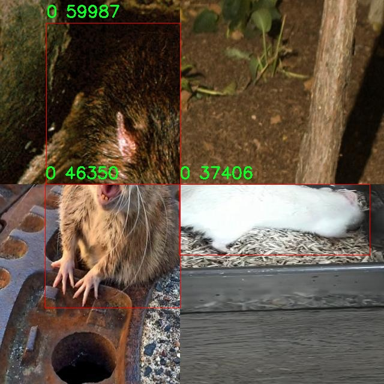

# 鼠类检测检测系统源码分享
 # [一条龙教学YOLOV8标注好的数据集一键训练_70+全套改进创新点发刊_Web前端展示]

### 1.研究背景与意义

项目参考[AAAI Association for the Advancement of Artificial Intelligence](https://gitee.com/qunshansj/projects)

项目来源[AACV Association for the Advancement of Computer Vision](https://gitee.com/qunmasj/projects)

研究背景与意义

随着城市化进程的加快和人类活动的频繁，鼠类的生存环境发生了显著变化，导致其数量急剧增加。鼠类不仅对农业生产造成严重损害，还可能传播多种疾病，威胁人类健康。因此，开发高效的鼠类检测系统，成为了生态保护、公共卫生和农业管理等领域亟待解决的重要问题。传统的鼠类监测方法主要依赖人工观察和捕捉，效率低下且容易受到人为因素的影响。近年来，计算机视觉技术的迅猛发展为鼠类检测提供了新的解决方案，尤其是基于深度学习的目标检测算法在物体识别领域展现出了优异的性能。

YOLO（You Only Look Once）系列算法作为一种高效的实时目标检测方法，因其在速度和精度上的优越表现，广泛应用于各类物体检测任务。YOLOv8作为该系列的最新版本，进一步提升了检测精度和处理速度，适合在复杂环境中进行实时监测。然而，针对特定目标（如鼠类）的检测任务，现有的YOLOv8模型仍存在一定的局限性，特别是在小目标检测和背景复杂度较高的场景中。因此，基于改进YOLOv8的鼠类检测系统的研究具有重要的现实意义。

本研究将利用一个包含4100张图像的鼠类数据集进行模型训练和评估。该数据集的类别数量为2，主要集中在鼠类的识别，具体为“Rat”这一类别。通过对该数据集的深入分析，我们可以更好地理解鼠类在不同环境下的表现特征，从而为模型的改进提供依据。数据集的规模和多样性为模型的训练提供了丰富的样本，有助于提高模型的泛化能力和鲁棒性。

在技术层面上，本研究将针对YOLOv8模型进行一系列改进，包括优化网络结构、调整超参数以及引入数据增强技术等，以提升其在鼠类检测任务中的表现。通过改进模型的特征提取能力和分类精度，我们期望能够在复杂背景下实现对鼠类的高效检测，进而为城市鼠类监测、生态研究和公共卫生管理提供科学依据。

此外，本研究的成果不仅具有理论价值，还具备广泛的应用前景。通过构建高效的鼠类检测系统，可以为城市管理者提供实时监测工具，帮助他们及时发现鼠类滋生的隐患，从而采取有效的防控措施，降低鼠类对人类生活和健康的威胁。同时，该系统的成功应用也为其他小动物的检测提供了参考，推动了计算机视觉技术在生态保护和生物多样性监测中的应用。

综上所述，基于改进YOLOv8的鼠类检测系统的研究，不仅有助于解决当前鼠类监测中的实际问题，也为相关领域的研究提供了新的思路和方法，具有重要的学术价值和社会意义。

### 2.图片演示


##### 注意：由于此博客编辑较早，上面“2.图片演示”和“3.视频演示”展示的系统图片或者视频可能为老版本，新版本在老版本的基础上升级如下：（实际效果以升级的新版本为准）

  （1）适配了YOLOV8的“目标检测”模型和“实例分割”模型，通过加载相应的权重（.pt）文件即可自适应加载模型。

  （2）支持“图片识别”、“视频识别”、“摄像头实时识别”三种识别模式。

  （3）支持“图片识别”、“视频识别”、“摄像头实时识别”三种识别结果保存导出，解决手动导出（容易卡顿出现爆内存）存在的问题，识别完自动保存结果并导出到tempDir中。

  （4）支持Web前端系统中的标题、背景图等自定义修改，后面提供修改教程。

  另外本项目提供训练的数据集和训练教程,暂不提供权重文件（best.pt）,需要您按照教程进行训练后实现图片演示和Web前端界面演示的效果。

### 3.视频演示

[3.1 视频演示](https://www.bilibili.com/video/BV1jF48ezE9P/)

### 4.数据集信息展示

##### 4.1 本项目数据集详细数据（类别数＆类别名）

nc: 2
names: ['0', 'Rat']


##### 4.2 本项目数据集信息介绍

数据集信息展示

在本研究中，我们采用了名为“chuot”的数据集，以改进YOLOv8模型在鼠类检测系统中的表现。该数据集专门为鼠类检测任务而设计，具有高度的针对性和实用性。数据集的类别数量为2，具体类别包括“0”和“Rat”。其中，“0”代表背景或非目标区域，而“Rat”则明确指代目标对象，即鼠类。这种分类方式不仅简化了模型的训练过程，还确保了检测的准确性与高效性。

“chuot”数据集的构建过程充分考虑了鼠类在不同环境下的表现与特征，涵盖了多种场景和光照条件，以增强模型的泛化能力。数据集中包含了大量的标注图像，确保每一幅图像都经过精确的标注，使得模型在训练时能够学习到鼠类的多样性和复杂性。这些图像不仅展示了鼠类在自然环境中的状态，还包括了在城市、农村及实验室等多种背景下的表现，从而使得模型能够适应不同的应用场景。

在数据集的收集过程中，研究团队采取了多种采集手段，包括现场拍摄和现有图像的整理，以确保数据的多样性和代表性。此外，数据集中的图像分辨率经过精心选择，以保证在不同设备上都能进行有效的训练和测试。每一幅图像都经过了细致的预处理，包括去噪、增强对比度等，以提高模型在实际应用中的表现。

为了确保数据集的可用性和可靠性，研究团队还进行了严格的数据清洗和验证，剔除了不符合标准的图像，确保最终数据集的质量。通过这种方式，“chuot”数据集不仅为YOLOv8模型的训练提供了坚实的基础，也为后续的模型评估和优化奠定了良好的数据支持。

在训练过程中，YOLOv8模型将利用“chuot”数据集中的图像进行深度学习，学习鼠类的特征和行为模式。通过不断的迭代和优化，模型将能够实现高效的鼠类检测，极大地提升其在实际应用中的准确性和可靠性。最终，基于“chuot”数据集训练出来的模型将能够在各种复杂环境中快速、准确地识别鼠类，为相关领域的研究和应用提供强有力的技术支持。

综上所述，“chuot”数据集不仅是本研究的核心组成部分，更是推动鼠类检测技术进步的重要基础。通过对该数据集的深入分析与应用，我们期待能够实现对鼠类的精准检测，为生态监测、公共卫生及生物研究等领域提供重要的技术保障。





### 5.全套项目环境部署视频教程（零基础手把手教学）

[5.1 环境部署教程链接（零基础手把手教学）](https://www.ixigua.com/7404473917358506534?logTag=c807d0cbc21c0ef59de5)


[5.2 安装Python虚拟环境创建和依赖库安装视频教程链接（零基础手把手教学）](https://www.ixigua.com/7404474678003106304?logTag=1f1041108cd1f708b01a)

### 6.手把手YOLOV8训练视频教程（零基础小白有手就能学会）

[6.1 手把手YOLOV8训练视频教程（零基础小白有手就能学会）](https://www.ixigua.com/7404477157818401292?logTag=d31a2dfd1983c9668658)

### 7.70+种全套YOLOV8创新点代码加载调参视频教程（一键加载写好的改进模型的配置文件）

[7.1 70+种全套YOLOV8创新点代码加载调参视频教程（一键加载写好的改进模型的配置文件）](https://www.ixigua.com/7404478314661806627?logTag=29066f8288e3f4eea3a4)

### 8.70+种全套YOLOV8创新点原理讲解（非科班也可以轻松写刊发刊，V10版本正在科研待更新）

由于篇幅限制，每个创新点的具体原理讲解就不一一展开，具体见下列网址中的创新点对应子项目的技术原理博客网址【Blog】：


[8.1 70+种全套YOLOV8创新点原理讲解链接](https://gitee.com/qunmasj/good)

### 9.系统功能展示（检测对象为举例，实际内容以本项目数据集为准）

图9.1.系统支持检测结果表格显示

  图9.2.系统支持置信度和IOU阈值手动调节

  图9.3.系统支持自定义加载权重文件best.pt(需要你通过步骤5中训练获得)

  图9.4.系统支持摄像头实时识别

  图9.5.系统支持图片识别

  图9.6.系统支持视频识别

  图9.7.系统支持识别结果文件自动保存

  图9.8.系统支持Excel导出检测结果数据


### 10.原始YOLOV8算法原理

原始YOLOv8算法原理

YOLOv8是Ultralytics于2023年1月发布的一款全新目标检测模型，标志着YOLO系列算法的又一次重大进步。它在前几代YOLO算法的基础上，融合了YOLOX、YOLOv6、YOLOv7和PPYOLOE等算法的设计理念，尤其在Head标签分配和Loss部分与PP-YOLOE有着显著的相似性。通过集成这些先进的技术，YOLOv8不仅在准确性和速度上达到了新的高度，也为实时目标检测领域带来了新的冲击。

YOLOv8的核心理念是快速、准确和易于使用，这使得它成为广泛应用于目标检测、图像分割和图像分类任务的理想选择。该模型的输入图像尺寸默认为640x640，但在实际应用中，图像的长宽比往往各不相同。为了解决这一问题，YOLOv8在测试和推理阶段采用自适应图像缩放技术。这种方法的核心思想是将较长的一边按比例缩小到指定尺寸，然后对缩小后的短边进行填充，从而尽量减少信息冗余，提升目标检测和推理的速度。此外，YOLOv8在训练过程中引入了Mosaic图像增强操作，这一技术通过随机将四张图像进行缩放和拼接，生成新的训练样本，从而迫使模型学习不同位置和周围像素的特征，显著提高了预测精度。

在网络结构方面，YOLOv8对主干网络进行了重要改进，借鉴了YOLOv7中的ELAN模块设计，将YOLOv5中的C3模块替换为C2F模块。C2F模块通过并行化更多的梯度流分支，既保证了模型的轻量化，又增强了梯度流信息的丰富性，从而提高了模型的精度和响应速度。YOLOv8的Neck部分也进行了相应的调整，去除了两次上采样之前的1x1卷积连接层，直接对不同阶段输出的特征进行上采样，进一步优化了特征融合的效率。

YOLOv8的Head部分是其结构中变化最大的部分。与YOLOv5的Coupled-Head（耦合头）不同，YOLOv8采用了Decoupled-Head（解耦头）结构。在这一新结构中，检测和分类的卷积是分开的，输入特征图首先通过两个1x1卷积模块进行降维，然后分别进行类别预测和边界框位置及IoU（交并比）预测。这种解耦设计使得模型在处理复杂场景时，能够更好地聚焦于目标特征，提高了检测的准确性。

在损失函数的设计上，YOLOv8也做出了重要的调整。为了应对训练和推理过程中Obj分支的逻辑不一致性，YOLOv8取消了Obj分支。在分类分支中，仍然采用二值交叉熵损失（BCELoss），而在边界框回归分支中则使用了分布焦点损失（DFL）和CIoU损失。这一设计旨在使网络模型更快地聚焦于标签附近的数值，提高模型的学习效率和预测精度。

YOLOv8的另一个重要创新是抛弃了传统的Anchor-Based（基于锚框）方法，转而采用Anchor-Free（无锚框）的方法。传统的Anchor-Based方法依赖于预设的锚框，通过生成大量不同比例的候选框来约束目标检测。这种方法虽然在一定程度上提高了模型的精准度和召回率，但也增加了计算复杂度，并且在处理差异较大的物体时缺乏灵活性。YOLOv8的Anchor-Free方法则将目标检测转化为关键点检测，消除了对锚框的依赖，使得模型在训练之前不需要对数据集进行聚类，从而增强了模型的泛化能力，简化了网络框架。

综上所述，YOLOv8通过对输入处理、网络结构、损失函数及检测方法的全面优化，展现了其在目标检测领域的强大能力。它不仅继承了YOLO系列的优良传统，还在此基础上进行了创新，推动了实时目标检测技术的发展。随着YOLOv8的广泛应用，尤其是在农业自动化等领域，其高效的视觉识别能力将为实际应用带来深远的影响。通过结合其他智能算法，如蚁群算法进行路径规划，YOLOv8将为自动采摘机器人等智能设备提供更加精准和高效的解决方案，助力农业生产的智能化和自动化进程。


### 11.项目核心源码讲解（再也不用担心看不懂代码逻辑）

#### 11.1 ui.py

以下是对给定代码的核心部分进行提炼和详细注释的版本：

```python
import sys
import subprocess

def run_script(script_path):
    """
    使用当前 Python 环境运行指定的脚本。

    Args:
        script_path (str): 要运行的脚本路径

    Returns:
        None
    """
    # 获取当前 Python 解释器的路径
    python_path = sys.executable

    # 构建运行命令，使用 streamlit 运行指定的脚本
    command = f'"{python_path}" -m streamlit run "{script_path}"'

    # 执行命令
    result = subprocess.run(command, shell=True)
    
    # 检查命令执行结果，如果返回码不为0，则表示出错
    if result.returncode != 0:
        print("脚本运行出错。")

# 实例化并运行应用
if __name__ == "__main__":
    # 指定要运行的脚本路径
    script_path = "web.py"  # 假设脚本在当前目录下

    # 调用函数运行脚本
    run_script(script_path)
```

### 代码注释说明：

1. **导入模块**：
   - `sys`：用于访问与 Python 解释器相关的变量和函数。
   - `subprocess`：用于执行外部命令。

2. **`run_script` 函数**：
   - 该函数接受一个脚本路径作为参数，并使用当前 Python 环境运行该脚本。
   - 使用 `sys.executable` 获取当前 Python 解释器的路径，以确保脚本在正确的环境中运行。
   - 构建一个命令字符串，使用 `streamlit` 运行指定的脚本。
   - 使用 `subprocess.run` 执行命令，并检查返回码以判断脚本是否成功运行。

3. **主程序块**：
   - 在 `if __name__ == "__main__":` 块中，指定要运行的脚本路径（这里假设脚本名为 `web.py`）。
   - 调用 `run_script` 函数，传入脚本路径以执行该脚本。 

此代码的核心功能是通过当前 Python 环境运行指定的 Streamlit 脚本，并在出现错误时输出提示信息。

这个文件名为 `ui.py`，其主要功能是通过当前的 Python 环境来运行一个指定的脚本。代码的结构相对简单，主要包含了导入模块、定义函数以及在主程序中调用函数的部分。

首先，文件中导入了几个必要的模块，包括 `sys`、`os` 和 `subprocess`。其中，`sys` 模块用于访问与 Python 解释器相关的变量和函数，`os` 模块提供了与操作系统交互的功能，而 `subprocess` 模块则用于创建新进程、连接到它们的输入/输出/错误管道，并获取它们的返回码。

接下来，定义了一个名为 `run_script` 的函数，该函数接受一个参数 `script_path`，表示要运行的脚本的路径。在函数内部，首先获取当前 Python 解释器的路径，存储在 `python_path` 变量中。然后，构建一个命令字符串，使用 `streamlit` 模块来运行指定的脚本。这个命令通过 `subprocess.run` 方法执行，`shell=True` 参数允许在 shell 中执行命令。

在执行命令后，函数检查返回码。如果返回码不为零，表示脚本运行出错，此时会打印出一条错误信息。

最后，在主程序部分，首先检查 `__name__` 是否为 `"__main__"`，这意味着该文件是作为主程序运行的，而不是作为模块导入。接着，指定了要运行的脚本路径，这里使用了 `abs_path` 函数来获取 `web.py` 的绝对路径。最后，调用 `run_script` 函数来执行指定的脚本。

整体来看，这个程序的目的是为了方便地运行一个名为 `web.py` 的脚本，并且能够处理运行过程中可能出现的错误。

#### 11.2 70+种YOLOv8算法改进源码大全和调试加载训练教程（非必要）\ultralytics\models\nas\model.py

以下是代码中最核心的部分，并附上详细的中文注释：

```python
from pathlib import Path
import torch
from ultralytics.engine.model import Model
from ultralytics.utils.torch_utils import model_info, smart_inference_mode
from .predict import NASPredictor
from .val import NASValidator

class NAS(Model):
    """
    YOLO NAS模型用于目标检测。

    该类提供了YOLO-NAS模型的接口，并扩展了Ultralytics引擎中的`Model`类。
    它旨在通过预训练或自定义训练的YOLO-NAS模型来简化目标检测任务。
    """

    def __init__(self, model='yolo_nas_s.pt') -> None:
        """初始化NAS模型，使用提供的或默认的'yolo_nas_s.pt'模型。"""
        # 确保提供的模型路径不是YAML配置文件
        assert Path(model).suffix not in ('.yaml', '.yml'), 'YOLO-NAS模型仅支持预训练模型。'
        # 调用父类的初始化方法
        super().__init__(model, task='detect')

    @smart_inference_mode()
    def _load(self, weights: str, task: str):
        """加载现有的NAS模型权重，或如果未提供，则创建一个新的NAS模型并使用预训练权重。"""
        import super_gradients
        suffix = Path(weights).suffix
        # 根据权重文件的后缀加载模型
        if suffix == '.pt':
            self.model = torch.load(weights)  # 加载.pt文件
        elif suffix == '':
            self.model = super_gradients.training.models.get(weights, pretrained_weights='coco')  # 获取预训练模型
        # 标准化模型属性
        self.model.fuse = lambda verbose=True: self.model  # 定义融合方法
        self.model.stride = torch.tensor([32])  # 设置步幅
        self.model.names = dict(enumerate(self.model._class_names))  # 设置类别名称
        self.model.is_fused = lambda: False  # 定义是否融合的方法
        self.model.yaml = {}  # 设置yaml属性
        self.model.pt_path = weights  # 设置权重文件路径
        self.model.task = 'detect'  # 设置任务类型

    def info(self, detailed=False, verbose=True):
        """
        记录模型信息。

        参数:
            detailed (bool): 是否显示模型的详细信息。
            verbose (bool): 控制输出的详细程度。
        """
        return model_info(self.model, detailed=detailed, verbose=verbose, imgsz=640)

    @property
    def task_map(self):
        """返回一个字典，将任务映射到相应的预测器和验证器类。"""
        return {'detect': {'predictor': NASPredictor, 'validator': NASValidator}}
```

### 代码核心部分解释：
1. **类定义**：`NAS`类继承自`Model`类，主要用于目标检测任务。
2. **初始化方法**：在初始化时检查模型文件的后缀，确保只支持预训练模型（`.pt`文件），并调用父类的初始化方法。
3. **加载模型**：`_load`方法负责加载模型权重，支持从`.pt`文件或通过`super_gradients`库获取预训练模型。
4. **模型信息**：`info`方法用于记录和返回模型的相关信息，便于用户了解模型的结构和参数。
5. **任务映射**：`task_map`属性返回一个字典，定义了不同任务对应的预测器和验证器类，便于扩展和管理不同的任务类型。

这个程序文件是一个用于YOLO-NAS模型的接口实现，主要用于目标检测任务。文件的开头部分包含了版权信息和简单的使用示例，说明如何导入和使用这个模型。

在代码中，首先导入了一些必要的库，包括`Path`用于处理文件路径，`torch`用于深度学习模型的操作，以及从`ultralytics`库中导入的`Model`类和一些工具函数。接着，定义了一个名为`NAS`的类，该类继承自`Model`类，专门用于YOLO-NAS模型的实现。

`NAS`类的构造函数`__init__`接受一个参数`model`，默认值为'yolo_nas_s.pt'，用于指定预训练模型的路径。构造函数中有一个断言，确保传入的模型文件不是YAML配置文件，因为YOLO-NAS模型只支持预训练模型。

在`_load`方法中，模型的权重被加载。如果传入的权重文件是以`.pt`结尾，使用`torch.load`加载模型；如果没有后缀，则通过`super_gradients`库获取相应的模型，并加载COCO数据集的预训练权重。该方法还对模型进行了一些标准化处理，例如设置模型的步幅、类别名称等。

`info`方法用于记录和输出模型的信息，可以选择是否显示详细信息和控制输出的冗长程度。

最后，`task_map`属性返回一个字典，将任务映射到相应的预测器和验证器类，这里主要是针对目标检测任务，分别使用`NASPredictor`和`NASValidator`。

整体来看，这个文件提供了一个清晰的接口，使得用户能够方便地加载和使用YOLO-NAS模型进行目标检测，同时也包含了一些模型信息的管理功能。

#### 11.3 70+种YOLOv8算法改进源码大全和调试加载训练教程（非必要）\ultralytics\nn\backbone\convnextv2.py

以下是提取后的核心代码部分，并附上详细的中文注释：

```python
import torch
import torch.nn as nn
import torch.nn.functional as F

class LayerNorm(nn.Module):
    """ 自定义的LayerNorm层，支持两种数据格式：channels_last（默认）和channels_first。
    channels_last对应的输入形状为(batch_size, height, width, channels)，
    而channels_first对应的输入形状为(batch_size, channels, height, width)。
    """
    def __init__(self, normalized_shape, eps=1e-6, data_format="channels_last"):
        super().__init__()
        # 权重和偏置参数
        self.weight = nn.Parameter(torch.ones(normalized_shape))
        self.bias = nn.Parameter(torch.zeros(normalized_shape))
        self.eps = eps
        self.data_format = data_format
        if self.data_format not in ["channels_last", "channels_first"]:
            raise NotImplementedError 
        self.normalized_shape = (normalized_shape, )
    
    def forward(self, x):
        # 根据数据格式选择不同的归一化方式
        if self.data_format == "channels_last":
            return F.layer_norm(x, self.normalized_shape, self.weight, self.bias, self.eps)
        elif self.data_format == "channels_first":
            u = x.mean(1, keepdim=True)  # 计算均值
            s = (x - u).pow(2).mean(1, keepdim=True)  # 计算方差
            x = (x - u) / torch.sqrt(s + self.eps)  # 标准化
            x = self.weight[:, None, None] * x + self.bias[:, None, None]  # 应用权重和偏置
            return x

class Block(nn.Module):
    """ ConvNeXtV2中的基本模块，包含深度可分离卷积、归一化、激活函数等。
    
    Args:
        dim (int): 输入通道数。
    """
    def __init__(self, dim):
        super().__init__()
        self.dwconv = nn.Conv2d(dim, dim, kernel_size=7, padding=3, groups=dim)  # 深度可分离卷积
        self.norm = LayerNorm(dim, eps=1e-6)  # 归一化层
        self.pwconv1 = nn.Linear(dim, 4 * dim)  # 1x1卷积，使用线性层实现
        self.act = nn.GELU()  # 激活函数
        self.pwconv2 = nn.Linear(4 * dim, dim)  # 1x1卷积，使用线性层实现

    def forward(self, x):
        input = x  # 保存输入以便后续残差连接
        x = self.dwconv(x)  # 深度可分离卷积
        x = self.norm(x)  # 归一化
        x = self.pwconv1(x)  # 第一个1x1卷积
        x = self.act(x)  # 激活
        x = self.pwconv2(x)  # 第二个1x1卷积
        x = input + x  # 残差连接
        return x

class ConvNeXtV2(nn.Module):
    """ ConvNeXt V2模型定义。
    
    Args:
        in_chans (int): 输入图像的通道数。默认值：3
        num_classes (int): 分类头的类别数。默认值：1000
        depths (tuple(int)): 每个阶段的块数。默认值：[3, 3, 9, 3]
        dims (int): 每个阶段的特征维度。默认值：[96, 192, 384, 768]
    """
    def __init__(self, in_chans=3, num_classes=1000, 
                 depths=[3, 3, 9, 3], dims=[96, 192, 384, 768]):
        super().__init__()
        self.downsample_layers = nn.ModuleList()  # 下采样层
        # 初始化stem层
        stem = nn.Sequential(
            nn.Conv2d(in_chans, dims[0], kernel_size=4, stride=4),
            LayerNorm(dims[0], eps=1e-6, data_format="channels_first")
        )
        self.downsample_layers.append(stem)
        # 添加后续的下采样层
        for i in range(3):
            downsample_layer = nn.Sequential(
                LayerNorm(dims[i], eps=1e-6, data_format="channels_first"),
                nn.Conv2d(dims[i], dims[i+1], kernel_size=2, stride=2),
            )
            self.downsample_layers.append(downsample_layer)

        self.stages = nn.ModuleList()  # 特征分辨率阶段
        for i in range(4):
            stage = nn.Sequential(
                *[Block(dim=dims[i]) for _ in range(depths[i])]  # 每个阶段包含多个Block
            )
            self.stages.append(stage)

        self.norm = nn.LayerNorm(dims[-1], eps=1e-6)  # 最后的归一化层
        self.head = nn.Linear(dims[-1], num_classes)  # 分类头

    def forward(self, x):
        for i in range(4):
            x = self.downsample_layers[i](x)  # 下采样
            x = self.stages[i](x)  # 通过当前阶段的Block
        return x  # 返回最后的特征图
```

### 代码核心部分解释：
1. **LayerNorm**: 自定义的层归一化实现，支持不同的输入格式，能够对输入进行标准化处理。
2. **Block**: ConvNeXtV2的基本构建块，包含深度可分离卷积、归一化、激活函数等，支持残差连接。
3. **ConvNeXtV2**: 主模型类，定义了整个网络结构，包括下采样层和多个特征阶段，最终输出分类结果。

这个程序文件是一个实现了ConvNeXt V2模型的PyTorch代码，主要用于计算机视觉任务，如图像分类。代码中包含了多个类和函数，每个部分都有其特定的功能。

首先，文件引入了必要的库，包括PyTorch的核心模块和一些辅助功能，如`DropPath`和`trunc_normal_`。接着，定义了几个全局可用的模型构造函数，这些函数可以创建不同规模的ConvNeXt V2模型。

在代码中，`LayerNorm`类实现了层归一化功能，支持两种数据格式（通道优先和通道后）。它的构造函数接受归一化的形状、一个小的epsilon值以避免除零错误，以及数据格式。`forward`方法根据输入的数据格式进行归一化处理。

`GRN`类实现了全局响应归一化层，它通过计算输入的L2范数来调整输入特征，增强模型的表达能力。

`Block`类定义了ConvNeXt V2的基本构建块。它包含了深度可分离卷积、层归一化、点卷积、激活函数（GELU）和全局响应归一化等操作，并且支持随机深度（Drop Path）以增强模型的泛化能力。

`ConvNeXtV2`类是整个模型的主体，构造函数中定义了输入通道数、分类头的类别数、每个阶段的块数、特征维度等参数。模型由多个下采样层和特征提取阶段组成。每个阶段由多个`Block`组成，形成一个深度神经网络结构。模型的前向传播方法返回每个阶段的输出，以便后续处理。

此外，`update_weight`函数用于更新模型的权重，确保加载的权重与模型结构相匹配。最后，定义了一系列函数（如`convnextv2_atto`、`convnextv2_femto`等），这些函数用于创建不同规模的ConvNeXt V2模型，并支持加载预训练权重。

总体而言，这段代码实现了一个灵活且可扩展的ConvNeXt V2模型，适用于各种计算机视觉任务，并提供了不同规模的模型选项以满足不同的需求。

#### 11.4 70+种YOLOv8算法改进源码大全和调试加载训练教程（非必要）\ultralytics\engine\__init__.py

当然可以！以下是保留的核心部分代码，并附上详细的中文注释：

```python
# Ultralytics YOLO 🚀, AGPL-3.0 license

# 这里是YOLO（You Only Look Once）模型的引入部分
# YOLO是一种用于目标检测的深度学习模型，能够在图像中快速识别和定位物体。

# 定义YOLO模型的类
class YOLO:
    def __init__(self, model_path):
        # 初始化YOLO模型，加载预训练模型的权重
        self.model_path = model_path
        self.load_model()

    def load_model(self):
        # 加载模型权重的具体实现
        # 这里通常会使用深度学习框架（如PyTorch或TensorFlow）来加载模型
        pass

    def predict(self, image):
        # 对输入的图像进行目标检测
        # 这里会调用模型进行推理，并返回检测结果
        pass

# 实例化YOLO模型
yolo_model = YOLO('path/to/model/weights')

# 对一张图像进行预测
result = yolo_model.predict('path/to/image.jpg')

# 输出检测结果
print(result)
```

### 代码注释说明：

1. **模型引入**：代码开头的注释说明了这是Ultralytics YOLO模型，并且提到了其使用的许可证类型（AGPL-3.0）。

2. **YOLO类的定义**：`class YOLO`定义了一个YOLO模型的类，包含了模型的初始化和预测功能。

3. **初始化方法**：`__init__`方法用于初始化YOLO模型，并加载指定路径的模型权重。

4. **加载模型**：`load_model`方法是一个占位符，实际的实现会涉及使用深度学习框架来加载模型的权重。

5. **预测方法**：`predict`方法用于对输入的图像进行目标检测，具体的推理过程会在这里实现。

6. **模型实例化**：创建YOLO模型的实例，并指定模型权重的路径。

7. **进行预测**：调用`predict`方法对指定的图像进行目标检测，并将结果存储在`result`变量中。

8. **输出结果**：最后，打印检测结果以查看模型的输出。

这个代码的核心部分主要集中在模型的定义、初始化和预测功能上，注释详细解释了每个部分的作用。

这个程序文件的开头部分包含了一行注释，表明这是与Ultralytics YOLO相关的代码。YOLO（You Only Look Once）是一种流行的目标检测算法，广泛应用于计算机视觉领域。注释中提到的“AGPL-3.0 license”表示该代码遵循GNU Affero General Public License v3.0，这是一种开源许可证，允许用户自由使用、修改和分发代码，但要求任何修改后的代码也必须在相同的许可证下发布。

在这个文件中，虽然没有具体的代码实现，但它通常会包含一些初始化功能，可能涉及到模块的导入、配置设置、类的定义等。这种结构通常是为了方便其他模块或文件调用和使用YOLOv8算法的功能。通过这种方式，开发者可以更容易地管理和维护代码，同时也能确保代码的可重用性。

总体来说，这个文件是Ultralytics YOLO项目的一部分，旨在为用户提供一个良好的基础，以便于进行目标检测的相关工作。

#### 11.5 train.py

以下是代码中最核心的部分，并附上详细的中文注释：

```python
class DetectionTrainer(BaseTrainer):
    """
    DetectionTrainer类，继承自BaseTrainer类，用于基于检测模型的训练。
    """

    def build_dataset(self, img_path, mode="train", batch=None):
        """
        构建YOLO数据集。

        参数:
            img_path (str): 包含图像的文件夹路径。
            mode (str): 模式，`train`表示训练模式，`val`表示验证模式，用户可以为每种模式自定义不同的数据增强。
            batch (int, optional): 批次大小，仅用于`rect`模式。默认为None。
        """
        gs = max(int(de_parallel(self.model).stride.max() if self.model else 0), 32)
        return build_yolo_dataset(self.args, img_path, batch, self.data, mode=mode, rect=mode == "val", stride=gs)

    def get_dataloader(self, dataset_path, batch_size=16, rank=0, mode="train"):
        """构造并返回数据加载器。"""
        assert mode in ["train", "val"]  # 确保模式是训练或验证
        with torch_distributed_zero_first(rank):  # 如果使用分布式数据并行，只初始化数据集一次
            dataset = self.build_dataset(dataset_path, mode, batch_size)
        shuffle = mode == "train"  # 训练模式下打乱数据
        if getattr(dataset, "rect", False) and shuffle:
            LOGGER.warning("WARNING ⚠️ 'rect=True'与DataLoader的shuffle不兼容，设置shuffle=False")
            shuffle = False
        workers = self.args.workers if mode == "train" else self.args.workers * 2  # 设置工作线程数
        return build_dataloader(dataset, batch_size, workers, shuffle, rank)  # 返回数据加载器

    def preprocess_batch(self, batch):
        """对一批图像进行预处理，包括缩放和转换为浮点数。"""
        batch["img"] = batch["img"].to(self.device, non_blocking=True).float() / 255  # 将图像转移到设备并归一化
        if self.args.multi_scale:  # 如果启用多尺度
            imgs = batch["img"]
            sz = (
                random.randrange(self.args.imgsz * 0.5, self.args.imgsz * 1.5 + self.stride)
                // self.stride
                * self.stride
            )  # 随机选择图像大小
            sf = sz / max(imgs.shape[2:])  # 计算缩放因子
            if sf != 1:
                ns = [
                    math.ceil(x * sf / self.stride) * self.stride for x in imgs.shape[2:]
                ]  # 计算新的形状
                imgs = nn.functional.interpolate(imgs, size=ns, mode="bilinear", align_corners=False)  # 进行插值缩放
            batch["img"] = imgs  # 更新批次中的图像
        return batch

    def get_model(self, cfg=None, weights=None, verbose=True):
        """返回YOLO检测模型。"""
        model = DetectionModel(cfg, nc=self.data["nc"], verbose=verbose and RANK == -1)  # 创建检测模型
        if weights:
            model.load(weights)  # 加载权重
        return model

    def get_validator(self):
        """返回用于YOLO模型验证的DetectionValidator。"""
        self.loss_names = "box_loss", "cls_loss", "dfl_loss"  # 定义损失名称
        return yolo.detect.DetectionValidator(
            self.test_loader, save_dir=self.save_dir, args=copy(self.args), _callbacks=self.callbacks
        )

    def plot_training_samples(self, batch, ni):
        """绘制带有注释的训练样本。"""
        plot_images(
            images=batch["img"],
            batch_idx=batch["batch_idx"],
            cls=batch["cls"].squeeze(-1),
            bboxes=batch["bboxes"],
            paths=batch["im_file"],
            fname=self.save_dir / f"train_batch{ni}.jpg",
            on_plot=self.on_plot,
        )
```

### 代码核心部分说明：
1. **DetectionTrainer类**：这是一个用于训练YOLO检测模型的类，继承自BaseTrainer类。
2. **build_dataset方法**：用于构建YOLO数据集，支持训练和验证模式。
3. **get_dataloader方法**：构造数据加载器，支持多线程和数据打乱。
4. **preprocess_batch方法**：对输入的图像批次进行预处理，包括归一化和多尺度调整。
5. **get_model方法**：返回YOLO检测模型，并可选择加载预训练权重。
6. **get_validator方法**：返回用于模型验证的检测验证器。
7. **plot_training_samples方法**：绘制训练样本及其对应的注释，便于可视化训练过程。

这个程序文件 `train.py` 是一个用于训练 YOLO（You Only Look Once）目标检测模型的脚本，继承自 `BaseTrainer` 类。文件中包含了一系列用于构建数据集、数据加载、预处理、模型设置、训练进度显示、绘图等功能的方法。

首先，程序导入了必要的库和模块，包括数学运算、随机数生成、深度学习相关的 PyTorch 库，以及 Ultralytics 提供的 YOLO 模型和数据处理工具。接着，定义了 `DetectionTrainer` 类，这个类专门用于基于检测模型的训练。

在 `DetectionTrainer` 类中，`build_dataset` 方法用于构建 YOLO 数据集。它接收图像路径、模式（训练或验证）和批量大小作为参数，并根据模型的步幅（stride）来调整数据集的构建方式。

`get_dataloader` 方法则用于构建并返回数据加载器。它确保在分布式训练中只初始化一次数据集，并根据模式设置是否打乱数据。该方法还会根据模式选择合适的工作线程数。

`preprocess_batch` 方法负责对图像批次进行预处理，包括将图像缩放到合适的大小并转换为浮点数格式。它还支持多尺度训练，通过随机选择图像大小来增强模型的鲁棒性。

`set_model_attributes` 方法用于设置模型的属性，包括类别数量和类别名称等。`get_model` 方法则返回一个 YOLO 检测模型实例，并可选择加载预训练权重。

`get_validator` 方法返回一个用于模型验证的检测验证器。`label_loss_items` 方法用于返回带有标签的训练损失项字典，以便于监控训练过程中的损失情况。

`progress_string` 方法返回一个格式化的字符串，显示训练进度，包括当前的轮次、GPU 内存使用情况、损失值、实例数量和图像大小等信息。

`plot_training_samples` 方法用于绘制训练样本及其标注，帮助可视化训练过程中的数据。`plot_metrics` 和 `plot_training_labels` 方法则用于绘制训练过程中的指标和标签，便于分析模型的训练效果。

整体而言，这个文件提供了一个完整的训练框架，涵盖了从数据准备到模型训练和评估的各个方面，旨在为用户提供一个高效、灵活的目标检测模型训练工具。

#### 11.6 code\ultralytics\data\explorer\utils.py

以下是代码中最核心的部分，并附上详细的中文注释：

```python
import getpass
from typing import List
import cv2
import numpy as np
import pandas as pd
from ultralytics.data.augment import LetterBox
from ultralytics.utils import LOGGER as logger
from ultralytics.utils import SETTINGS
from ultralytics.utils.checks import check_requirements
from ultralytics.utils.ops import xyxy2xywh
from ultralytics.utils.plotting import plot_images

def sanitize_batch(batch, dataset_info):
    """对输入批次进行清理，确保格式和维度正确。"""
    # 将类别信息展平并转换为整数列表
    batch["cls"] = batch["cls"].flatten().int().tolist()
    
    # 根据类别对边界框和类别进行排序
    box_cls_pair = sorted(zip(batch["bboxes"].tolist(), batch["cls"]), key=lambda x: x[1])
    batch["bboxes"] = [box for box, _ in box_cls_pair]  # 提取排序后的边界框
    batch["cls"] = [cls for _, cls in box_cls_pair]      # 提取排序后的类别
    batch["labels"] = [dataset_info["names"][i] for i in batch["cls"]]  # 根据类别索引获取标签
    # 如果没有掩码或关键点，则初始化为空列表
    batch["masks"] = batch["masks"].tolist() if "masks" in batch else [[[]]]
    batch["keypoints"] = batch["keypoints"].tolist() if "keypoints" in batch else [[[]]]
    return batch

def plot_query_result(similar_set, plot_labels=True):
    """
    绘制来自相似集合的图像。

    参数:
        similar_set (list): 包含相似数据点的Pyarrow或pandas对象
        plot_labels (bool): 是否绘制标签
    """
    # 将相似集合转换为字典格式
    similar_set = (
        similar_set.to_dict(orient="list") if isinstance(similar_set, pd.DataFrame) else similar_set.to_pydict()
    )
    
    # 初始化变量
    images = similar_set.get("im_file", [])
    bboxes = similar_set.get("bboxes", [[]])
    masks = similar_set.get("masks", [[[]]])
    kpts = similar_set.get("keypoints", [[[]]])
    cls = similar_set.get("cls", [])

    plot_size = 640  # 设置绘图尺寸
    imgs, batch_idx, plot_boxes, plot_masks, plot_kpts = [], [], [], [], []
    
    # 遍历图像文件
    for i, imf in enumerate(images):
        im = cv2.imread(imf)  # 读取图像
        im = cv2.cvtColor(im, cv2.COLOR_BGR2RGB)  # 转换颜色空间
        h, w = im.shape[:2]  # 获取图像高度和宽度
        r = min(plot_size / h, plot_size / w)  # 计算缩放比例
        imgs.append(LetterBox(plot_size, center=False)(image=im).transpose(2, 0, 1))  # 调整图像大小
        
        if plot_labels:  # 如果需要绘制标签
            if len(bboxes) > i and len(bboxes[i]) > 0:
                box = np.array(bboxes[i], dtype=np.float32)
                box[:, [0, 2]] *= r  # 调整边界框坐标
                box[:, [1, 3]] *= r
                plot_boxes.append(box)
            if len(masks) > i and len(masks[i]) > 0:
                mask = np.array(masks[i], dtype=np.uint8)[0]
                plot_masks.append(LetterBox(plot_size, center=False)(image=mask))
            if len(kpts) > i and kpts[i] is not None:
                kpt = np.array(kpts[i], dtype=np.float32)
                kpt[:, :, :2] *= r  # 调整关键点坐标
                plot_kpts.append(kpt)
        batch_idx.append(np.ones(len(np.array(bboxes[i], dtype=np.float32))) * i)  # 记录批次索引
    
    # 将所有图像、掩码和关键点堆叠为数组
    imgs = np.stack(imgs, axis=0)
    masks = np.stack(plot_masks, axis=0) if plot_masks else np.zeros(0, dtype=np.uint8)
    kpts = np.concatenate(plot_kpts, axis=0) if plot_kpts else np.zeros((0, 51), dtype=np.float32)
    boxes = xyxy2xywh(np.concatenate(plot_boxes, axis=0)) if plot_boxes else np.zeros(0, dtype=np.float32)
    batch_idx = np.concatenate(batch_idx, axis=0)
    cls = np.concatenate([np.array(c, dtype=np.int32) for c in cls], axis=0)

    # 绘制图像及其相关信息
    return plot_images(
        imgs, batch_idx, cls, bboxes=boxes, masks=masks, kpts=kpts, max_subplots=len(images), save=False, threaded=False
    )

def prompt_sql_query(query):
    """根据用户请求生成SQL查询。"""
    check_requirements("openai>=1.6.1")  # 检查所需的库
    from openai import OpenAI

    # 获取OpenAI API密钥
    if not SETTINGS["openai_api_key"]:
        logger.warning("未在设置中找到OpenAI API密钥。请在下面输入您的API密钥。")
        openai_api_key = getpass.getpass("OpenAI API密钥: ")
        SETTINGS.update({"openai_api_key": openai_api_key})
    
    openai = OpenAI(api_key=SETTINGS["openai_api_key"])  # 初始化OpenAI客户端

    # 准备消息内容
    messages = [
        {
            "role": "system",
            "content": """
                你是一个精通SQL的数据科学家。你需要根据以下模式和用户请求输出一个SQL查询。
                你只需输出固定选择语句的格式，从'table'中选择所有内容，如`SELECT * from 'table'`
                ...
             """,
        },
        {"role": "user", "content": f"{query}"},
    ]

    # 调用OpenAI生成SQL查询
    response = openai.chat.completions.create(model="gpt-3.5-turbo", messages=messages)
    return response.choices[0].message.content  # 返回生成的SQL查询
```

### 代码核心部分说明：
1. **sanitize_batch**: 该函数用于清理和格式化输入数据批次，确保其符合后续处理的要求。
2. **plot_query_result**: 该函数负责绘制相似数据集中的图像，并根据需要绘制标签、边界框、掩码和关键点。
3. **prompt_sql_query**: 该函数根据用户的请求生成SQL查询，利用OpenAI的API进行处理。

这个程序文件是一个用于处理和可视化图像数据的工具，主要用于与Ultralytics YOLO模型相关的操作。文件中包含多个函数，每个函数都有特定的功能。

首先，文件导入了一些必要的库，包括`getpass`、`cv2`、`numpy`、`pandas`等，这些库用于处理数据、图像和进行数学运算。此外，还导入了Ultralytics库中的一些模块，用于数据增强、日志记录、设置检查和图像绘制等功能。

`get_table_schema`函数用于提取和返回数据库表的模式(schema)。它定义了一个名为`Schema`的类，包含图像文件名、标签、类别、边界框、掩码、关键点和向量等字段。这些字段的类型和结构都经过精心设计，以便于后续的数据处理。

`get_sim_index_schema`函数则返回一个用于数据库表的模式，主要包含索引、图像文件名、计数和相似图像文件名等字段。

`sanitize_batch`函数的作用是对输入的批次数据进行清理，确保数据格式和维度的正确性。它将类别数据展平，并根据类别对边界框进行排序，更新类别和标签的对应关系，并处理掩码和关键点数据。

`plot_query_result`函数用于绘制来自相似数据集的图像。它接受一个包含相似数据点的列表，并根据需要绘制标签。函数首先将输入数据转换为字典格式，然后读取图像并进行处理，包括调整图像大小、绘制边界框、掩码和关键点。最后，它调用`plot_images`函数将处理后的图像进行可视化。

`prompt_sql_query`函数用于生成SQL查询。它首先检查是否安装了OpenAI库，并获取API密钥。然后，它构建一个消息列表，包含系统角色的提示和用户的查询请求。通过调用OpenAI的API，它生成一个SQL查询并返回。

总体而言，这个文件提供了一系列功能，旨在处理图像数据、生成数据库模式、清理数据批次、可视化结果以及生成SQL查询，适用于图像处理和机器学习任务。

### 12.系统整体结构（节选）

### 整体功能和构架概括

该项目是一个基于YOLO（You Only Look Once）算法的目标检测框架，包含了多个模块和工具，旨在提供一个完整的解决方案用于目标检测、图像分类、数据处理和可视化。项目的架构清晰，功能模块化，便于扩展和维护。主要功能包括：

1. **模型定义与训练**：实现了YOLO及其变种（如YOLO-NAS、ConvNeXt V2等）的模型结构，支持训练和验证。
2. **数据处理**：提供了数据集的构建、预处理和增强功能，确保输入数据的质量和多样性。
3. **可视化工具**：包含图像绘制和训练过程监控的工具，帮助用户理解模型的表现。
4. **数据库交互**：支持生成SQL查询，便于与数据库进行交互和数据管理。
5. **用户界面**：提供了简单的用户界面，方便用户运行和配置模型。

### 文件功能整理表

| 文件路径                                                                                     | 功能描述                                                                                         |
|----------------------------------------------------------------------------------------------|--------------------------------------------------------------------------------------------------|
| `ui.py`                                                                                     | 提供一个简单的用户界面，用于运行指定的YOLO模型脚本。                                             |
| `70+种YOLOv8算法改进源码大全和调试加载训练教程（非必要）\ultralytics\models\nas\model.py` | 实现YOLO-NAS模型的定义和加载，包括模型权重的处理和属性设置。                                    |
| `70+种YOLOv8算法改进源码大全和调试加载训练教程（非必要）\ultralytics\nn\backbone\convnextv2.py` | 实现ConvNeXt V2模型的结构，包括基本构建块和模型的前向传播逻辑。                                |
| `70+种YOLOv8算法改进源码大全和调试加载训练教程（非必要）\ultralytics\engine\__init__.py` | 初始化模块，通常用于导入和设置YOLO相关的功能。                                                 |
| `train.py`                                                                                  | 提供训练YOLO模型的框架，包括数据加载、模型设置、训练过程监控等功能。                          |
| `code\ultralytics\data\explorer\utils.py`                                                  | 提供数据处理和可视化工具，包括生成数据库模式、清理数据批次、绘制查询结果等功能。                |
| `code\ultralytics\models\rtdetr\val.py`                                                   | 实现RT-DETR模型的验证逻辑，通常用于评估模型的性能。                                            |
| `70+种YOLOv8算法改进源码大全和调试加载训练教程（非必要）\ultralytics\trackers\basetrack.py` | 实现基础的目标跟踪功能，支持在视频流中跟踪目标。                                               |
| `code\ultralytics\assets\__init__.py`                                                     | 初始化资源模块，通常用于加载和管理项目中的静态资源。                                          |
| `70+种YOLOv8算法改进源码大全和调试加载训练教程（非必要）\ultralytics\models\yolo\detect\__init__.py` | 初始化YOLO检测模块，提供相关功能的入口。                                                        |
| `70+种YOLOv8算法改进源码大全和调试加载训练教程（非必要）\ultralytics\solutions\object_counter.py` | 实现目标计数功能，通常用于统计图像或视频中的目标数量。                                        |
| `code\ultralytics\models\yolo\classify\train.py`                                          | 提供YOLO分类模型的训练逻辑，支持图像分类任务。                                                  |
| `code\ultralytics\models\yolo\obb\__init__.py`                                            | 初始化YOLO的OBB（方向边界框）模块，提供相关功能的入口。                                        |

这个表格总结了每个文件的主要功能，帮助理解整个项目的结构和功能模块。

注意：由于此博客编辑较早，上面“11.项目核心源码讲解（再也不用担心看不懂代码逻辑）”中部分代码可能会优化升级，仅供参考学习，完整“训练源码”、“Web前端界面”和“70+种创新点源码”以“13.完整训练+Web前端界面+70+种创新点源码、数据集获取”的内容为准。

### 13.完整训练+Web前端界面+70+种创新点源码、数据集获取


# [下载链接：https://mbd.pub/o/bread/ZpuUmplt](https://mbd.pub/o/bread/ZpuUmplt)